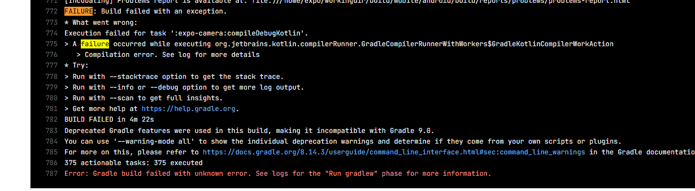
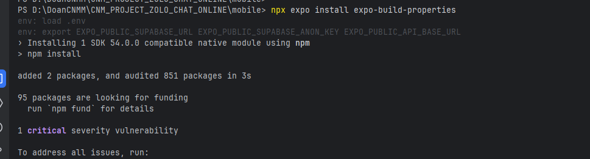
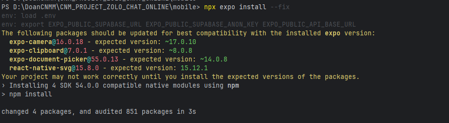
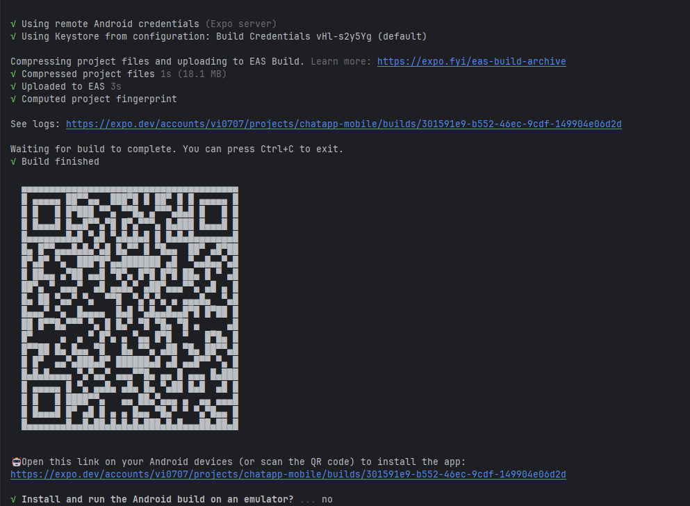

# Zolo Chat - Backend Progress Report

---

## Tổng quan

Dự án hiện đang chạy trên 2 nền tảng:

- Web (build bằng Vite)
- Mobile (React Native - Expo Go Android)

Các chức năng chính đã hoạt động ổn định trên cả hai nền tảng.

---

## Những chức năng đã hoàn thành

### 1. Hệ thống tin nhắn

- Gửi tin nhắn văn bản
- Trả lời tin nhắn (Reply)
- Chỉnh sửa tin nhắn (Edit)
- Thu hồi tin nhắn (Recall)
- Xóa tin nhắn phía người dùng (Delete for me)
- Trạng thái người dùng

Áp dụng Optimistic UI giúp hiển thị tin nhắn ngay khi gửi.

---

### 2. Voice Message

- Ghi âm bằng MediaRecorder
- Tự động xử lý format theo môi trường
- Upload và tạo message
- Hiển thị thời lượng

Đã test ổn định trên web và mobile.

---

### 3. Upload file và hình ảnh

- Upload qua multipart/form-data
- Sử dụng uploadService dùng chung
- Lưu metadata vào Attachment model
- Tự động gắn vào message

File được lưu trên AWS S3 và sử dụng CloudFront để tăng tốc độ tải.

---

### 4. Realtime (Socket)

Đã triển khai:

- Nhận tin nhắn realtime
- Typing indicator
- Reaction realtime
- Thu hồi / chỉnh sửa tin nhắn realtime
- Trạng thái đã xem

---

### 5. Reaction

- Lấy danh sách emoji từ server
- Toggle reaction
- Đồng bộ realtime

---

### 6. Conversation

- Lấy danh sách cuộc trò chuyện
- Tạo chat 1-1 (DM)
- Cập nhật tin nhắn cuối
- Phân trang bằng cursor

---

### 7. Trạng thái người dùng

- Online / Offline
- Last seen
- Hiển thị realtime

---

### 8. Media và Attachments

Đã hoàn thiện:

- Lấy danh sách ảnh và file trong conversation
- Hiển thị đầy đủ trên:
    - Web (Vite)
    - Mobile (Expo Go Android)
- Hỗ trợ preview ảnh và mở file

---

### 9. Các chức năng bổ sung

- Forward tin nhắn
- Mark as read
- Delete for me

---

## Những vấn đề đã xử lý

### Upload file trên React Native

Vấn đề:
- Gặp lỗi Network Error khi upload

Nguyên nhân:
- Axios không xử lý đúng FormData trên React Native

Giải pháp:
- Override transformRequest
- Set Content-Type phù hợp

Hiện tại đã hoạt động ổn định.

---

### Hiển thị media trên mobile

Vấn đề:
- Mobile không hiển thị được attachments

Đã fix:
- Gọi đúng API getAttachments
- Xử lý lại data phù hợp với UI mobile
- Hiển thị được danh sách ảnh và file

---

### Tối ưu hiệu năng

- Sử dụng cursor-based pagination
- Tránh load toàn bộ tin nhắn
- Lazy load khi cần

---

## Tình trạng hiện tại

- Web (Vite): Hoạt động ổn định
- Mobile (Expo Go):
    - Chat realtime ổn định
    - Upload file / voice / image hoạt động tốt
    - Đã hiển thị được media (attachments)

---

## Hướng phát triển tiếp theo

- Tối ưu upload file dung lượng lớn
- Cải thiện UI/UX
- Thêm tính năng group chat
- Tăng độ ổn định khi mạng yếu

---

## Người thực hiện

Ng Vi

---

## Development Build (Expo)

### Khái niệm

Development Build là một bản APK tự build từ project, khác với Expo Go (app có sẵn trên Play Store).

---

### So sánh

| Tiêu chí | Expo Go | Development Build |
|----------|--------|------------------|
| Là gì | App có sẵn của Expo | APK tự build từ project |
| Cài đặt | Play Store | File APK |
| Native modules | Giới hạn | Hỗ trợ đầy đủ |
| Thời gian build | Không cần | 10-20 phút |

---

### Luồng hoạt động

- Build APK một lần và cài vào điện thoại
- Chạy `npx expo start` như bình thường
- Mở app đã cài để kết nối với Metro bundler
- Hỗ trợ hot reload

---

### Cách build Development Build (Android)

Bước 1: Cài EAS CLI
npm install -g eas-cli

Bước 2: Đăng nhập Expo

eas login

Bước 3: Cài expo-dev-client

npx expo install expo-dev-client

Bước 4: Cấu hình EAS

eas build:configure

Bước 5: Build APK

eas build --platform android --profile development

Bước 6: Cài APK lên điện thoại

Bước 7: Chạy dev server

npx expo start --dev-client

---

### Lưu ý

- EAS build miễn phí (có giới hạn)
- Chỉ cần build lại khi thay đổi native modules
- Code JS không cần build lại
- Thiết bị và máy tính cần cùng mạng WiFi khi dev

---
Nếu lỗi!

install về 

Thêm vào app.json 

[app.json](Update/app.json)
vẫn lỗi Error: Gradle build failed with unknown error. See logs for the "Run gradlew" phase for more information.
insstall fix các module cũ 

SAU KHI COMPLETE THÌ 

Giờ có 2 cách cài APK lên điện thoại:

Cách 1 — Quét QR (dễ nhất):
Dùng camera điện thoại quét QR code hiện trong terminal → mở link → tải và cài APK.

Cách 2 — Mở link trực tiếp trên điện thoại:

https://expo.dev/accounts/......

Mở link này trên trình duyệt Android → nhấn Download.

Lưu ý khi cài:

Điện thoại sẽ hỏi "Cho phép cài từ nguồn không rõ" → nhấn Cho phép
Sau khi cài xong, mở app → app sẽ hỏi địa chỉ server
Sau khi cài, chạy dev server:

npx expo start --dev-client

Rồi trong app → quét QR hoặc nhập IP máy tính → kết nối.

Còn câu hỏi trong terminal Install and run the Android build on an emulator? (Y/n) — nếu bạn dùng điện thoại thật thì nhấn n.
### QUAN TRỌNG NHẤT LƯU Ý NHÉ MẤY BẠN GIÁM ĐỐC TƯƠNG LAI ::: native module thay và app.json thì mới cần build lại APK NHA, còn code  thay đổi và ip thay đôir thì k cần rebuild đâu, 
// Bên Frontend Web

cập nhật .env VITE_SOCKET_URL=http://192.168.88.135:2026 thay ip thành ip mạng riêng của mn nhé
## Còn đây là file docs lý thuyết và các lưu ý lỗi cần tránh giống ở comnmit trước
[webRTC.md](webRTC.md)