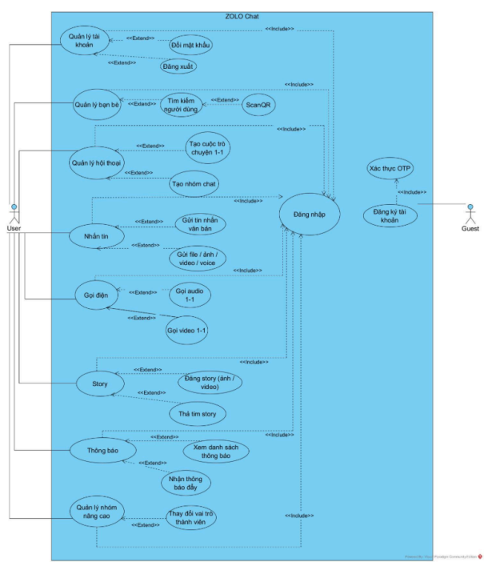
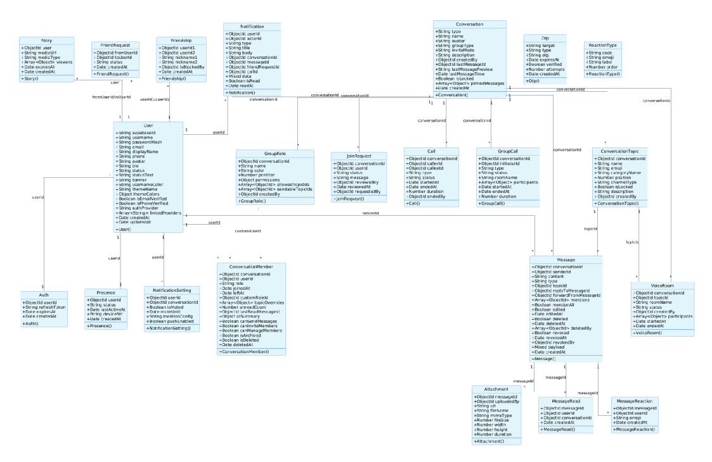
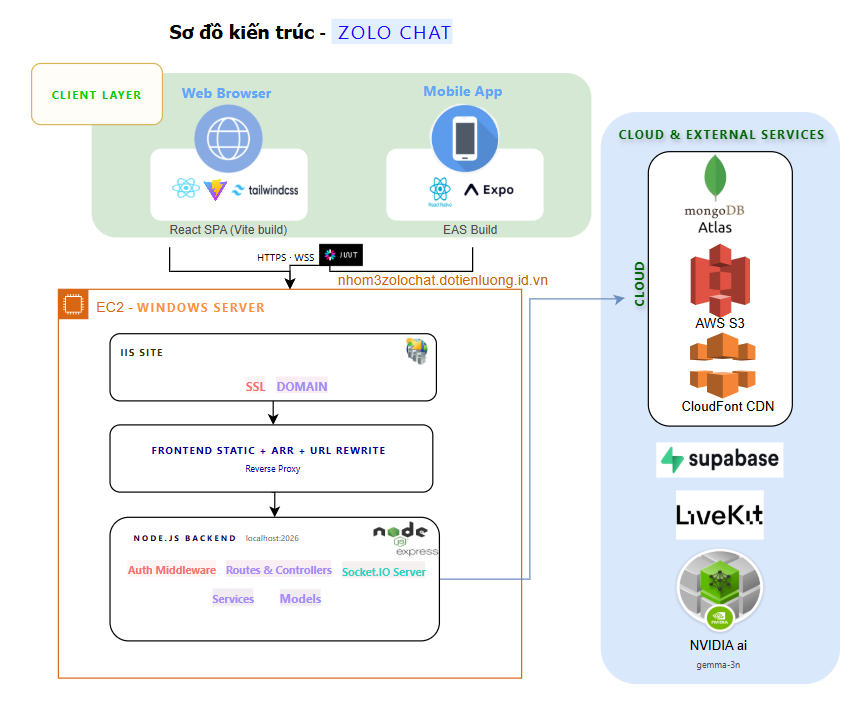
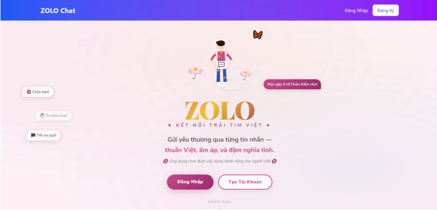
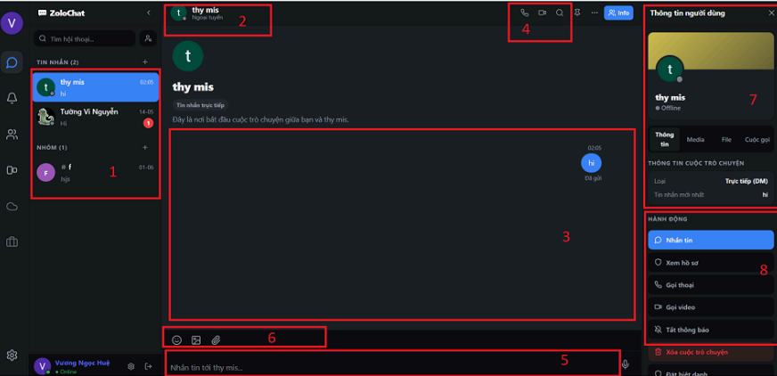
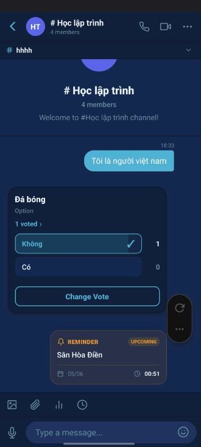

# Zolo Chat Online


<p align="center">
    https://nhom3zolochat.dotienluong.id.vn/
</p>
## Giới thiệu dự án

Zolo Chat Online là ứng dụng nhắn tin đa nền tảng hỗ trợ chat thời gian thực, gọi video/audio, chia sẻ tệp, stories, thông báo và tóm tắt hội thoại bằng AI.

Dự án được phát triển cho cả web và mobile, sử dụng một backend chung để đồng bộ dữ liệu và trải nghiệm người dùng.

## Tính năng nổi bật

- Nhắn tin 1-1 và nhóm theo thời gian thực.
- Gọi video 1-1 bằng WebRTC.
- Gọi video nhóm và voice room bằng LiveKit SFU.
- Gửi hình ảnh, video, âm thanh và tài liệu qua AWS S3/CloudFront.
- Stories tồn tại 24 giờ.
- Thông báo realtime qua Socket.IO.
- Xác thực bằng JWT, Refresh Token, OAuth và OTP.
- Tóm tắt hội thoại bằng AI.

## Use Case Diagram


## Class Diagram

## Atriture Diagram


## Một vài giao diện

### Trang đăng nhập

### Trang nhắn tin



## Công nghệ sử dụng

- Frontend web: React.js, Vite, Tailwind CSS.
- Mobile: React Native, Expo.
- Backend: Node.js, Express.js.
- Realtime: Socket.IO.
- Call media: WebRTC, LiveKit.
- Database: MongoDB Atlas, Mongoose.
- Storage: AWS S3, CloudFront.
- Deploy: AWS EC2, IIS, ARR Reverse Proxy.
- AI: NVIDIA NIM API.


## Cài đặt

### Backend
```bash
cd backend
npm install
npm run dev
```

### Web
```bash
cd web
npm install
npm run dev
```

### Mobile
```bash
cd mobile
npm install
npx expo start
```

## Cấu trúc thư mục

```bash
project/
├── backend/
├── web/
├── mobile/
├── docs/
│   └── images/
└── README.md
```

## Thành viên nhóm

- Trần Trọng Huy
- Tiên Lương
- Nguyễn Thị Tường Vi
- Vũ Ngọc Huệ
- Trần Phương Trà

## Hướng phát triển

- Tối ưu khả năng mở rộng.
- Bổ sung mã hóa đầu-cuối.
- Cải thiện AI smart reply và tóm tắt.
- Nâng cấp hệ thống thông báo và presence.